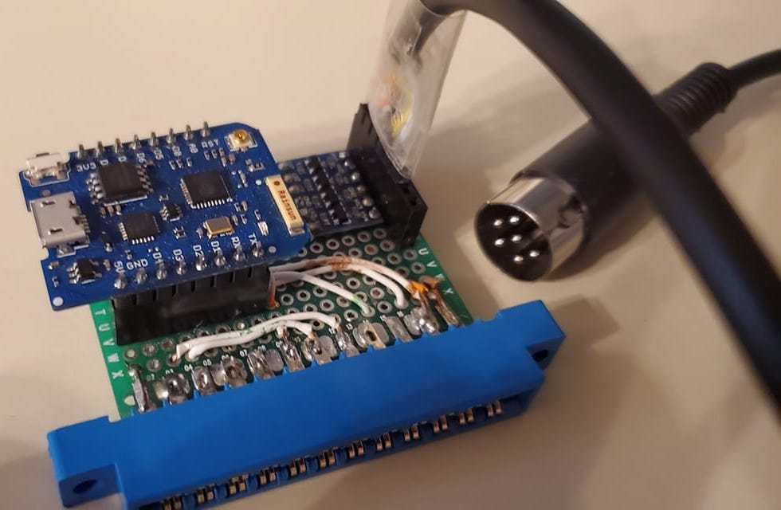
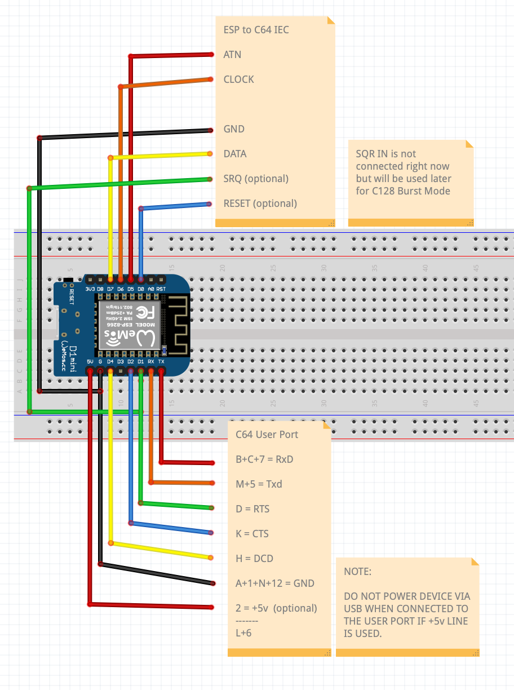

A Commodore IEC Serial Floppy Drive and WiFi Modem multi-device emulator

*** NOTE: ESP32 Firmware can be found in the following repo: [https://github.com/idolpx/meatloaf-specialty](https://github.com/idolpx/meatloaf-specialty)

It's easy to wire up too. No need for the level shifter as shown in the circuit above. 
([Espressif CEO confirmed 5V tolerance of ESP8255, ESP8285 & ESP32.](https://www.facebook.com/groups/1499045113679103/permalink/1731855033731442)) 
You can also leave off the edge card connector if you you just want to try out the drive emulation functionality.

## Components

Microcontroller
* 1 × [ESP8266 Dev Board](https://www.aliexpress.com/item/4000880936043.html) (Wemos D1 MINI/D1 MINI PRO 16M, NODEMCU, etc) 
I like the 16MB version. 
or 
* 1 x [ESP32 Dev Board](https://www.aliexpress.com/item/32883116057.html) 
This one has 16MB Flash, 8MB PSRAM, Micro SD with I2C & TFT Port! 
(Meatloaf is not working yet on the ESP32 but it will be soon.)

Virtual Drive - IEC Serial Port (minimal build)

* 1 × [6 PIN DIN Male Plug](https://www.aliexpress.com/item/33058840658.html)
* 1 × [6 Core 26AWG Wire Cable](https://www.aliexpress.com/item/1005002313534749.html) (12" or better, I got extra)

Virtual Modem - User Port (optional)

* 1 × [24 PIN (2x12) 805 Series 3.96mm Pitch PCB Slot Solder Card Edge Connector](https://www.aliexpress.com/item/4000246156457.html)
* 1 × [5x7cm Proto Board](https://www.aliexpress.com/item/4000285110600.html)

To setup your own Meatloaf server check out this code.
(<https://github.com/idolpx/meatloaf-svr>)

I'm now working to bring this functionality to the [#FujiNet](https://github.com/FujiNetWIFI/fujinet-platformio) project too!
They had the same idea but for Atari 8bit machines and are much further along than I am.
I'm working with them to add CBM support to their device.

## Key Features

* IEC Bus interface for loading data directly from flash memory or via HTTP
* Can mount Meatloaf's flash file system via WebDAV to modify contents
* Can be configured to emulate multiple IEC devices (IDs 4-30)
* Each device's configuration is switched out and persisted on access
* WiFi modem for connecting to telnet BBSs
* Minimal part count and easy to assemble
* Firmware can be updated via HTTP

## To Do

* Standardize all Hayes Commands and add extended commands
* Complete CBM DOS support
* Extend CBM DOS with device specific features
* Support all different CBM file, disk, tape, cart media image files from local flash file system
* Add support for Fast Loaders & JiffyDOS
* Port all code to ESP32 IDF
* Add SD card interface
* Add Cassette tape interface
* Add virtual printer/plotter interface
* Add ZoomFloppy/IECHost capabilities
* Add .URL/.WEBLOC file support (change URL/DIR when loading them)
* If image isn't local, write saves to hidden folder ".save" (include hash of URL/PATH/IMAGE in filename)
* Add web server for configuration and control (http root hidden folder ".www")

## References

* [Commodore Peripheral Bus: Overview](https://www.pagetable.com/?p=1018)
* [IEC disected](http://www.zimmers.net/anonftp/pub/cbm/programming/serial-bus.pdf)
* [Vice emulator file formats](https://vice-emu.sourceforge.io/vice_17.html#SEC329)
* [Burst Fastloader for C64](https://a1bert.kapsi.fi/Dev/burst/)
* [Inside Commodore DOS](https://www.pagetable.com/docs/Inside%20Commodore%20DOS.pdf)

## Code is based on and inspired by the following

* [Steve White's Pi1541](https://github.com/pi1541/Pi1541)
* [Lars Wadefalk's UNO2IEC](https://github.com/Larswad/uno2iec)
* [Ingo Korb's SD2IEC](https://sd2iec.de/)
* [Paul Rickard's ESP8266 Modem](https://github.com/RolandJuno/esp8266_modem)
* [Ardyesp's ESPWebDAV](https://github.com/ardyesp/ESPWebDAV)
