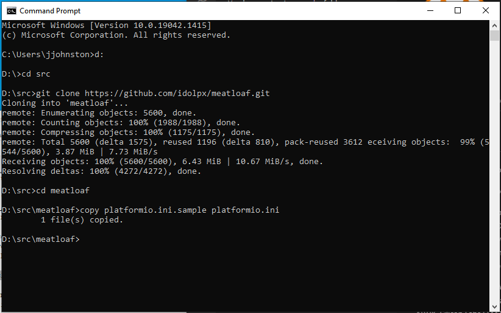
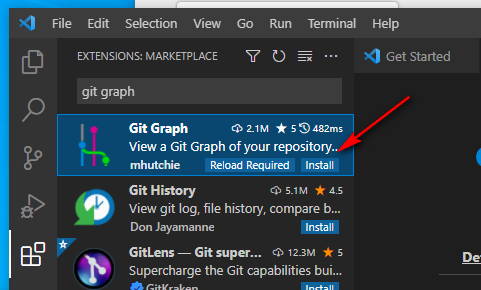
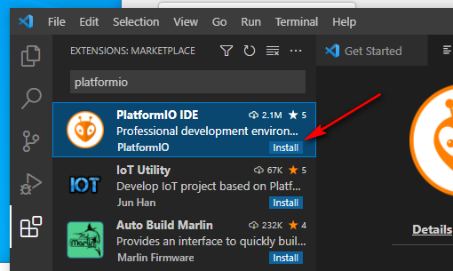
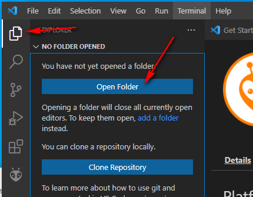
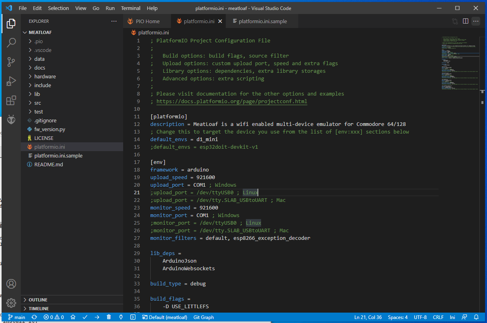
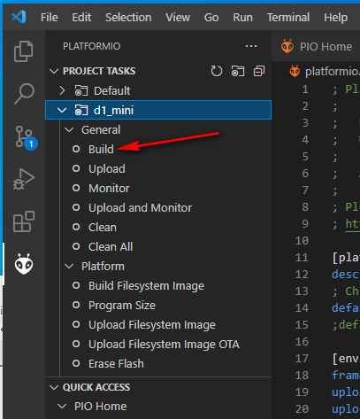
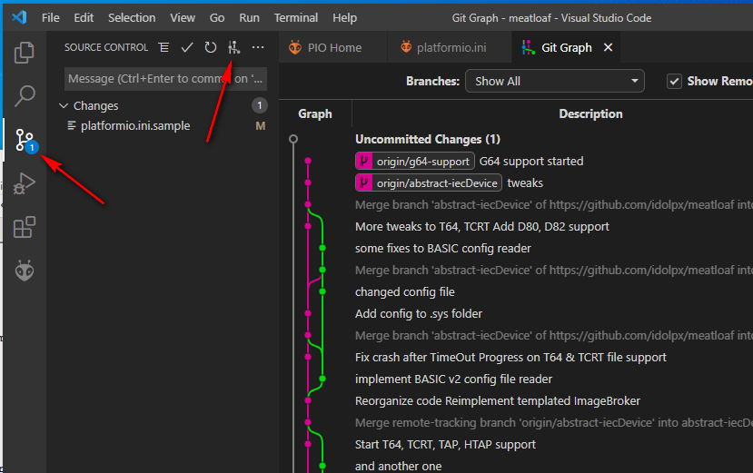
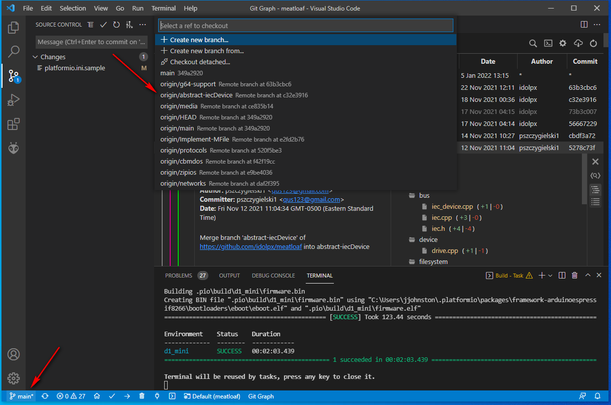
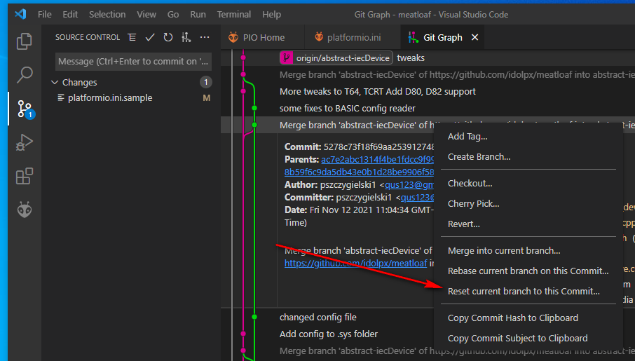

# Windows Dev Environment Setup

1. Install "git" for windows 
	 https://git-scm.com/download/win 
	 It's fine to take all default settings
	
2. Open a command prompt and change directory to the folder 
	 where you want to download the Meatloaf firmware. 
	 Enter the following command.
	
	 > git clone https://github.com/idolpx/meatloaf.git
	
	 The firmware source code will be downloaded and put into a sub directory named "meatloaf".
	 Change into the directory and copy the platformio.ini.sample file to platformio.ini.
	
	 > cd meatloaf
	 
	 > copy platformio.ini.sample platformio.ini
	
	
	
3. Install Visual Studio Code 
	 https://code.visualstudio.com/Download 
	 Take default options during setup. 
	 (I also check off the extra options for adding the 
	 "Open with Code" context menu option for files and folders.) 
	 
	 Launch VS Code and click on the "Extensions" icon in the side menu. 
	 Search for "Git Graph" and select it and install it. 
	 
	 
	 Search for "PlatformIO" and select it and install it. 
	 
	
4. Open the Meatloaf folder in VS Code. 
	 Click "File/Open Folder" and browse to select the "meatloaf" folder that was created earlier.
	 
	
5. Edit "platformio.ini" by uncommenting and editing the windows options for upload and monitor port.
	 Comment out the Linux and Mac options if they are not already.
	 Save the file.
	 
	
6. Compile the firmware. 
	 The easiest way to do this is to hit the "check" icon in the status bar. 
	 *(The first time you build it will take a long time. It has to install the platform tools and all dependancies required for the build process.)* 
	 
	  
	 You can also use the build option under Project Tasks in the PlatformIO icon from the side menu.
	 
	  
	 Success!!! 
	 
	
7. Upload the firmware. 
	 You can use the "right arrow" in the status bar to upload the firmware to your ESP module.
	 The "Upload" option is also available under Project Tasks in the PlatformIO icon from the side menu.
	
8. Build and Upload Filesystem Image 
	 This task is available under Project Tasks in the PlatformIO icon from the side menu.

## Using Git Graph

1. Click the "Source Control" icon from the side menu.
2. Click the "View Git Graph (git log)" button to the right of "SOURCE CONTROL".
	 When viewing the graph you can switch see all commits to all branches of the code.
	 You can right click on a branch label to checkout that branch. 
	  
	  
	 You can also switch branches by activating the menu dropdown list by clicking the 
	 current branch label at the far left of the status bar. 
	  
	  
	 To switch to a specific commit, right click on a the commit in the graph.
	 Then select "Reset current branch to this Commit..." from the menu. 
	  
	  

